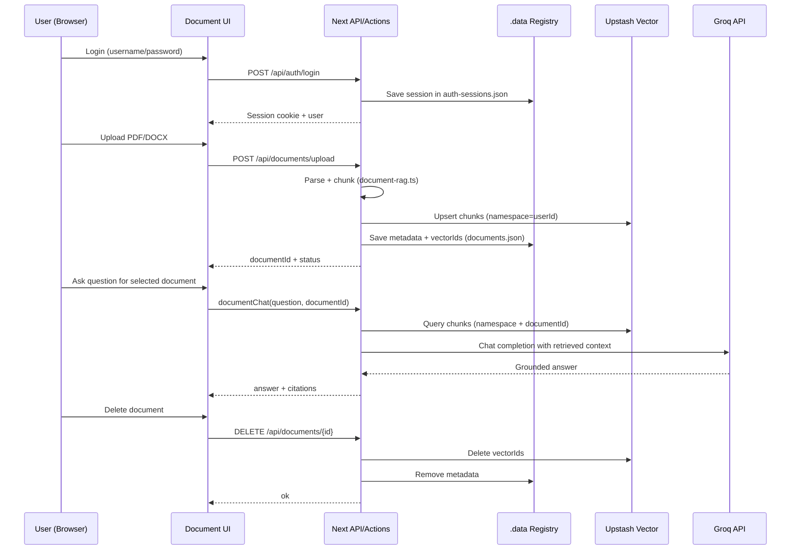

# Legal Document Chat (PDF/DOCX) - Detailed Implementation Plan

## Objective

Build a secure legal-document assistant that can:

1. Accept PDF and Word documents (`.pdf`, `.docx`)
2. Extract and index content safely
3. Enable multi-turn conversation grounded in uploaded documents
4. Protect sensitive legal data with strong security and governance controls

---

## Success Criteria

- Users can upload a legal PDF/DOCX and chat against its content within 60-120 seconds for typical files.
- Answers include citations to document sections/pages.
- Data is encrypted in transit and at rest.
- Access controls prevent cross-tenant data leakage.
- Retention and deletion workflows are auditable and reliable.
- Security baseline is documented, tested, and review-ready.

---

## Current Baseline (What we already have)

- Next.js application with server actions and API routes
- RAG pattern already implemented in this codebase and adapted for legal document chat
- Upstash Vector integration for semantic retrieval
- MCP tooling and simulation/testing scripts

This allows us to reuse core RAG orchestration and focus effort on document ingestion, tenant security, and compliance controls.

---

## Target Architecture

1. **Upload Layer**
   - Secure upload endpoint for PDF/DOCX
   - File type validation and malware scanning hook
   - Store original files in private object storage (or encrypted local blob for MVP)

2. **Document Processing Layer**
   - Extract text from PDF/DOCX
   - Normalize and chunk text with section/page metadata
   - Create embeddings and upsert into vector index using scoped metadata

3. **Retrieval + Chat Layer**
   - Query vector index with strict filters (`tenantId`, `userId`, `documentId`)
   - Inject retrieved context into LLM prompt
   - Return answer + citations + confidence indicators

4. **Security + Governance Layer**
   - AuthN/AuthZ, encryption, audit logging, retention, deletion, and incident response controls

---

## Implementation Phases

## Phase 0 - Security & Product Requirements (Week 1)

### Tasks

- Define trust boundaries and threat model
  - Actors: student, admin, assessor, external attacker
  - Assets: uploaded docs, embeddings, chat history, keys, logs
  - Risks: unauthorized access, prompt injection, data exfiltration, accidental retention

- Define legal/security requirements
  - Data classification policy (public/internal/confidential/legal-sensitive)
  - Retention period per document class
  - Access and sharing rules

- Define functional scope for MVP
  - Single-user private workspace (MVP)
  - Supported formats: `.pdf`, `.docx`
  - Max file size, max pages, processing timeout limits

### Deliverables

- `docs/security-requirements.md`
- `docs/threat-model.md`
- Approved MVP scope checklist

---

## Phase 1 - File Upload and Storage Foundation (Week 1-2)

### Tasks

- Add upload UI
  - Drag-and-drop and manual file picker
  - Show upload status: queued, processing, ready, failed

- Build upload API route
  - Validate MIME type and extension
  - Enforce file size and page-count limits
  - Reject encrypted/password-protected files (or support explicitly)

- Store files securely
  - Use private bucket/container with no public URLs
  - Generate document record with `documentId`, owner, timestamps, status

- Add checksum and integrity metadata
  - SHA-256 digest for file integrity and duplicate detection

### Deliverables

- Upload endpoint and document metadata model
- Initial `documents` table/schema and storage integration

---

## Phase 2 - Parsing, Chunking, and Embedding Pipeline (Week 2)

### Tasks

- Implement text extraction service
  - PDF parser with page-level extraction
  - DOCX parser for paragraphs/headings/tables

- Build normalization pipeline
  - Remove control artifacts
  - Preserve section structure where possible
  - Track `page`, `sectionHeading`, `paragraphIndex`

- Implement legal-aware chunking
  - Chunk size ~500-1000 tokens with overlap 80-150
  - Keep clause boundaries when possible
  - Store chunk metadata:
    - `tenantId`, `userId`, `documentId`
    - `documentTitle`, `pageRange`, `section`
    - `classification`, `createdAt`

- Embed and upsert
  - Batch embeddings with retries and backoff
  - Mark document status: `processed` or `failed`

### Deliverables

- `lib/document-ingestion.ts`
- Background processing flow
- Ingestion logs and failure reasons

---

## Phase 3 - Document-grounded Chat Experience (Week 3)

### Tasks

- Add document selection context in chat UI
  - Chat per selected document
  - Optional multi-document mode (post-MVP)

- Extend RAG server action
  - Query vector DB with strict ownership filters
  - Retrieve top-k chunks with reranking/score threshold
  - Build secure prompt:
    - System: answer only from provided context
    - If unknown: explicitly say insufficient evidence

- Add citations and answer controls
  - Show cited pages/sections per response
  - Expose “View source chunk” in UI
  - Add low-confidence fallback response template

### Deliverables

- `app/actions-document-chat.ts` (or merged secure extension)
- Updated chat UI with document mode and citations

---

## Phase 4 - Security Hardening for Legal Documents (Week 3-4)

### Core Security Controls

1. **Identity and Access**
   - Mandatory authentication
   - Role-based and ownership-based authorization
   - Every query filtered by `tenantId` and `userId`

2. **Encryption**
   - TLS for all network traffic
   - Encryption at rest for file store and database/vector services
   - Secret management via environment variables + managed key service

3. **Data Isolation**
   - Metadata-based tenant partitioning (minimum)
   - Optional physical index separation per tenant (higher assurance)

4. **Prompt Injection and Data Exfiltration Defense**
   - Strip/flag malicious instruction patterns in source docs
   - Prompt policy: never reveal system prompt, keys, or cross-document data
   - Output guardrails for sensitive fields (PII/entity masking as needed)

5. **Logging and Auditing**
   - Structured audit events: upload, parse, query, delete, admin action
   - Redact sensitive payloads from logs
   - Tamper-evident log retention policy

6. **Retention and Deletion**
   - Configurable retention windows by document class
   - One-click “Delete document” removes:
     - Original file
     - Parsed artifacts
     - Vector embeddings
     - Associated chat context
   - Deletion verification job + audit trail

### Deliverables

- `docs/security-controls.md`
- Red-team checklist for prompt/data leakage
- Security test report (MVP baseline)

---

## Phase 5 - Compliance, Quality, and Operations (Week 4)

### Tasks

- Add policy and governance docs
  - Acceptable use policy
  - Privacy notice and consent for uploads
  - Incident response playbook

- Implement monitoring and alerts
  - Upload failures, parser failures, retrieval misses, latency spikes
  - Security alerting for anomalous access patterns

- Build evaluation suite
  - Gold Q/A set from sample legal docs
  - Metrics: citation accuracy, groundedness, false-hallucination rate, latency

- Operational runbooks
  - Key rotation
  - Service outage fallback
  - Data subject deletion requests

### Deliverables

- `docs/compliance-checklist.md`
- `docs/incident-response.md`
- `docs/operations-runbook.md`

---

## Phase 6 - Pilot and Gradual Rollout (Week 5)

### Tasks

- Internal pilot with a controlled legal-document set
- Collect quality and security feedback from users/stakeholders
- Apply fixes for top issues
- Roll out in staged gates:
  - Gate 1: Internal users
  - Gate 2: Limited external pilot
  - Gate 3: Production release

### Deliverables

- Pilot report
- Go/No-Go checklist
- Production release notes

---

## Work Breakdown by Module

## 1) Frontend

- Upload component with progress + status badges
- Document list + processing state
- Chat view with citation panel
- Delete and retention actions with confirmations

## 2) Backend/API

- `POST /api/documents/upload`
- `POST /api/documents/:id/process`
- `POST /api/documents/:id/chat`
- `DELETE /api/documents/:id`

## 3) Core Libraries

- `lib/document-parser.ts`
- `lib/document-chunker.ts`
- `lib/document-embeddings.ts`
- `lib/document-retrieval.ts`
- `lib/security/audit.ts`

## 4) Data Model (example)

- `documents`: id, tenantId, userId, title, type, status, checksum, createdAt
- `document_chunks`: id, documentId, page, section, text, metadata
- `chat_sessions`: id, userId, documentId, createdAt
- `chat_messages`: sessionId, role, content, citations, createdAt

---

## Security Design Decisions (Recommended Defaults)

- **Default deny** access policy for all document operations
- **No public document links**
- **Sensitive logs redacted** by default
- **Hard retrieval filters** (`tenantId`, `userId`, `documentId`) on every query
- **Data minimization**: only store required metadata and bounded chat history

---

## Risks and Mitigations

| Risk | Impact | Mitigation |
| --- | --- | --- |
| Parser errors on complex legal formatting | Medium | Multi-parser fallback + extraction QA checks |
| Hallucinated legal interpretations | High | Strict grounding + citations + “insufficient evidence” fallback |
| Cross-tenant data leakage | Critical | Mandatory tenant/user filters + authz middleware tests |
| Prompt injection in uploaded docs | High | Content scanning + guarded prompts + output policy checks |
| Unbounded storage costs | Medium | File size limits + retention + archival policies |

---

## Testing Strategy

1. **Unit Tests**
   - Parser, chunker, metadata filters, authz helpers

2. **Integration Tests**
   - Upload -> parse -> embed -> retrieve -> answer
   - Deletion cascade integrity

3. **Security Tests**
   - Broken object level authorization tests
   - Prompt injection simulation
   - Data leakage regression tests

4. **Evaluation Tests**
   - Citation relevance
   - Groundedness score
   - Latency SLA

---

## Suggested Timeline (5 Weeks)

- **Week 1:** Requirements, threat model, upload baseline
- **Week 2:** Parsing/chunking/embedding pipeline
- **Week 3:** Chat UX + retrieval + citations
- **Week 4:** Security hardening + compliance + runbooks
- **Week 5:** Pilot, fixes, staged production rollout

---

## Immediate Next Actions (This Week)

1. Finalize MVP constraints (file limits, user model, retention period)
2. Implement upload endpoint + document schema
3. Implement parser/chunker pipeline for PDF + DOCX
4. Add retrieval filtering with strict owner constraints
5. Add citation-enabled response rendering in chat UI

---

## Current Implemented Workflow (As Built)

This section explains the actual runtime flow in the current codebase.

## 1) Authentication and Session

1. User opens `/documents` page (`app/documents/page.tsx` + `components/document-chat.tsx`).
2. UI checks session via `GET /api/auth/me` (`app/api/auth/me/route.ts`).
3. Login uses `POST /api/auth/login` (`app/api/auth/login/route.ts`).
4. Server auth logic is in `lib/document-auth.ts`:
  - Session cookie: `dt_doc_session` (httpOnly)
  - Session store: `.data/auth-sessions.json`
  - User roles: `admin` / `user`

## 2) Upload and Ingestion (PDF/DOCX)

1. User uploads file from `components/document-chat.tsx`.
2. UI sends `multipart/form-data` to `POST /api/documents/upload` (`app/api/documents/upload/route.ts`).
3. Route validates:
  - Auth/RBAC (`requireDocumentRole`)
  - Size limit (10 MB)
  - File type (`.pdf`, `.docx`)
4. File is read into memory as `Buffer` (not persisted as raw file in current MVP).
5. Parsing/chunking happens in `lib/document-rag.ts`:
  - PDF: `pdf-parse/lib/pdf-parse.js`
  - DOCX: `mammoth`
  - Chunking: normalized text + overlap strategy
6. Embeddings are upserted to Upstash Vector using namespace = authenticated user id.
7. Metadata record is stored in `.data/documents.json` via `lib/document-registry.ts`:
  - `documentId`, `ownerId`, `fileName`, `chunkCount`, `vectorIds`, etc.

## 3) Document List and Selection

1. UI calls `GET /api/documents` (`app/api/documents/route.ts`).
2. Server returns documents owned by current authenticated user.
3. User selects one `documentId` in the dropdown.

## 4) Chat Against Selected Document

1. User asks a question in `components/document-chat.tsx`.
2. UI calls server action `documentChat()` in `app/actions-document-chat.ts` with:
  - `question`
  - `documentId`
  - optional `messages` history
3. `documentChat()` validates auth and verifies ownership via `lib/document-registry.ts`.
4. Retrieval executes in `searchDocumentChunks()` (`lib/document-rag.ts`):
  - Query Upstash Vector in user namespace
  - Filter to selected `documentId`
  - Return top chunks with `sourceLabel` and score
5. Context is assembled from retrieved chunks.
6. Request is sent to Groq Chat Completions API (`https://api.groq.com/openai/v1/chat/completions`) from `app/actions-document-chat.ts`.
7. Groq response + retrieved sources are returned to UI.
8. UI renders answer and citation blocks (source label + snippet + score).

## 5) Deletion Workflow

1. User clicks Delete for selected document.
2. UI calls `DELETE /api/documents/[id]` (`app/api/documents/[id]/route.ts`).
3. Server verifies auth + ownership.
4. Server deletes vectors in Upstash using stored `vectorIds` (`deleteDocumentVectors` in `lib/document-rag.ts`).
5. Server removes document metadata from `.data/documents.json` (`deleteDocumentRecord` in `lib/document-registry.ts`).

## 6) Data Storage Map (Current MVP)

- **Authentication sessions:** `.data/auth-sessions.json`
- **Document metadata (owner mapping, vector IDs):** `.data/documents.json`
- **Raw uploaded file:** Not persisted (processed from in-memory buffer)
- **Embeddings/chunks:** Upstash Vector (namespaced by user id)
- **LLM generation:** Groq API call from `app/actions-document-chat.ts`

## 7) Sequence Diagram

